# Домашнее задание к занятию «Вычислительные мощности. Балансировщики нагрузки»  

### Подготовка к выполнению задания

1. Домашнее задание состоит из обязательной части, которую нужно выполнить на провайдере Yandex Cloud, и дополнительной части в AWS (выполняется по желанию). 
2. Все домашние задания в блоке 15 связаны друг с другом и в конце представляют пример законченной инфраструктуры.  
3. Все задания нужно выполнить с помощью Terraform. Результатом выполненного домашнего задания будет код в репозитории. 
4. Перед началом работы настройте доступ к облачным ресурсам из Terraform, используя материалы прошлых лекций и домашних заданий.

---
## Задание 1. Yandex Cloud 

**Что нужно сделать**

1. Создать бакет Object Storage и разместить в нём файл с картинкой:

 - Создать бакет в Object Storage с произвольным именем (например, _имя_студента_дата_).
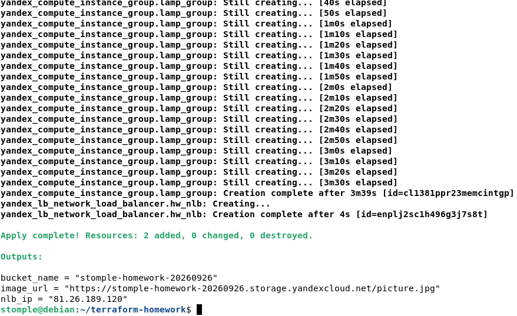
 - Положить в бакет файл с картинкой.

 - Сделать файл доступным из интернета.
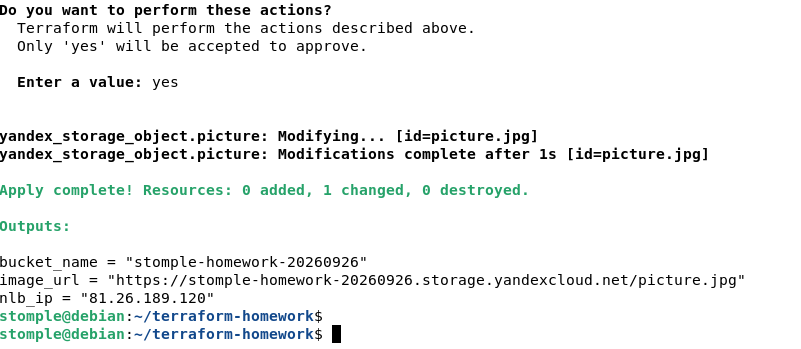
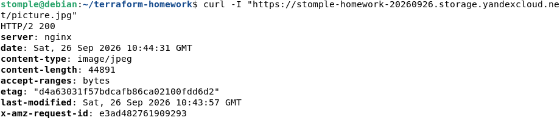 

2. Создать группу ВМ в public подсети фиксированного размера с шаблоном LAMP и веб-страницей, содержащей ссылку на картинку из бакета:

 - Создать Instance Group с тремя ВМ и шаблоном LAMP. Для LAMP рекомендуется использовать `image_id = fd827b91d99psvq5fjit`.


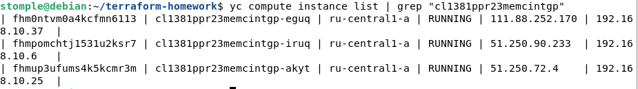
 - Для создания стартовой веб-страницы рекомендуется использовать раздел `user_data` в [meta_data](https://cloud.yandex.ru/docs/compute/concepts/vm-metadata).
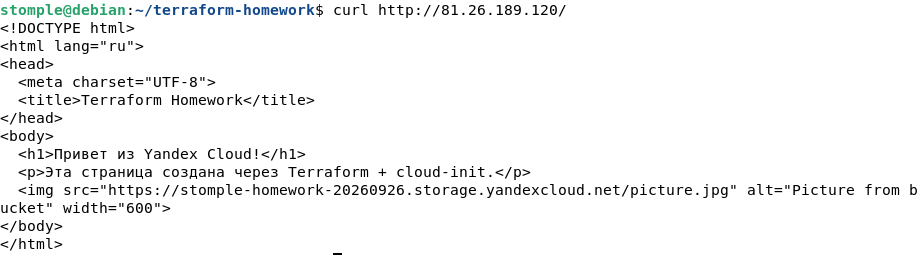
 - Разместить в стартовой веб-странице шаблонной ВМ ссылку на картинку из бакета.
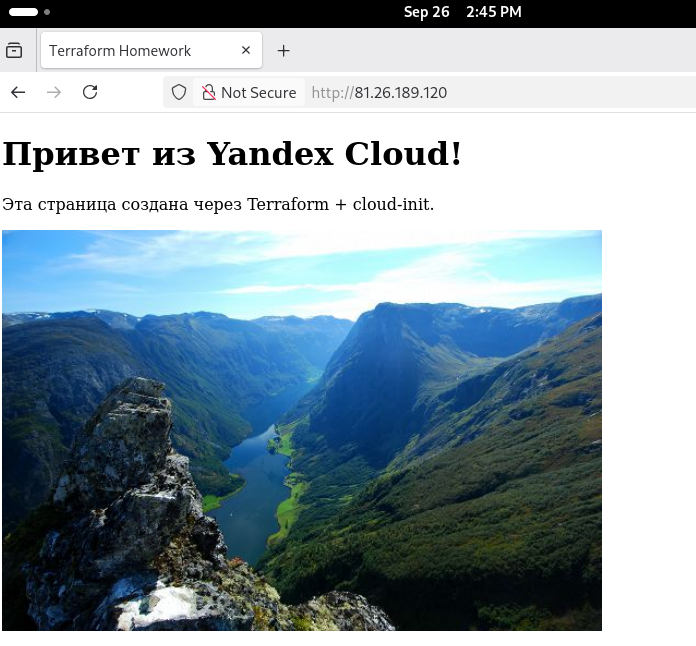
 - Настроить проверку состояния ВМ.
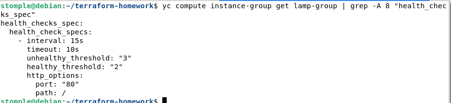

3. Подключить группу к сетевому балансировщику:

 - Создать сетевой балансировщик.
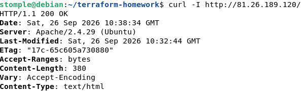
 - Проверить работоспособность, удалив одну или несколько ВМ.
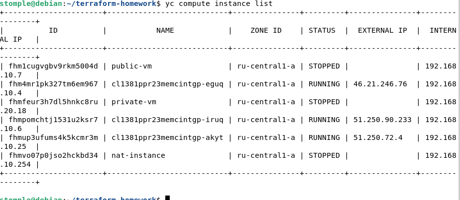
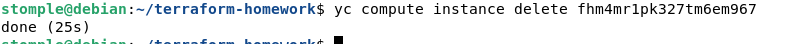
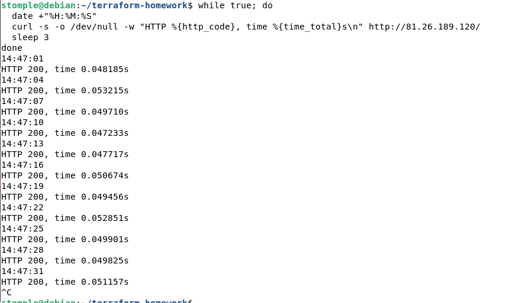
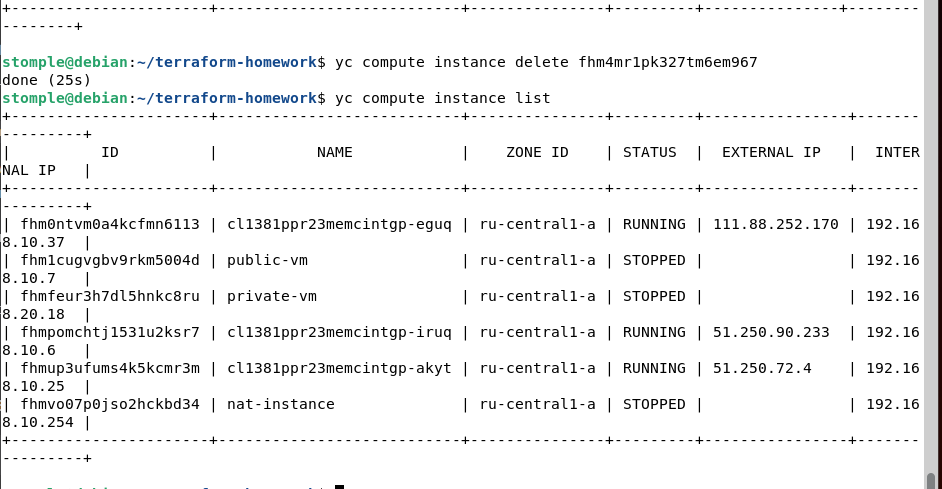
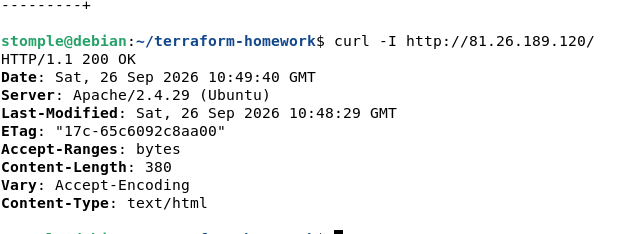


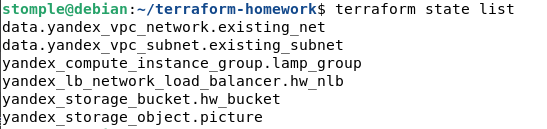
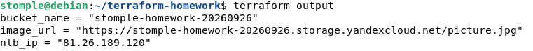

---

## Листинги конфигурации Terraform

- [`provider.tf`](provider.tf) — провайдер
- [`variables.tf`](variables.tf) — переменные
- [`bucket.tf`](bucket.tf) — бакет и объект
- [`instance-group.tf`](instance-group.tf) — сеть, подсеть, Instance Group
- [`network-lb.tf`](network-lb.tf) — сетевой балансировщик
- [`outputs.tf`](outputs.tf) — output-значения

Полезные документы:

- [Compute instance group](https://registry.terraform.io/providers/yandex-cloud/yandex/latest/docs/resources/compute_instance_group).
- [Network Load Balancer](https://registry.terraform.io/providers/yandex-cloud/yandex/latest/docs/resources/lb_network_load_balancer).
- [Группа ВМ с сетевым балансировщиком](https://cloud.yandex.ru/docs/compute/operations/instance-groups/create-with-balancer).

---
### Правила приёма работы

Домашняя работа оформляется в своём Git репозитории в файле README.md. Выполненное домашнее задание пришлите ссылкой на .md-файл в вашем репозитории.
Файл README.md должен содержать скриншоты вывода необходимых команд, а также скриншоты результатов.
Репозиторий должен содержать тексты манифестов или ссылки на них в файле README.md.


# Домашнее задание к занятию «Безопасность в облачных провайдерах»  

Используя конфигурации, выполненные в рамках предыдущих домашних заданий, нужно добавить возможность шифрования бакета.

---
## Задание 1. Yandex Cloud   

1. С помощью ключа в KMS необходимо зашифровать содержимое бакета:

 - создать ключ в KMS;

KMS-ключ создан декларативно через Terraform (файл `kms.tf`):

```hcl
resource "yandex_kms_symmetric_key" "bucket_key" {
  name              = "bucket-encryption-key"
  description       = "Ключ для шифрования бакета Object Storage"
  default_algorithm = "AES_128"
  rotation_period   = "8760h"
}
```
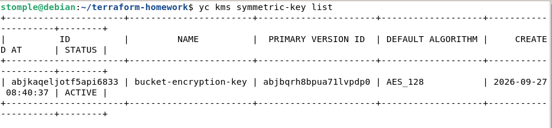

 - с помощью ключа зашифровать содержимое бакета, созданного ранее.

В манифест `bucket.tf` добавлен блок `server_side_encryption_configuration`:

```hcl
server_side_encryption_configuration {
  rule {
    apply_server_side_encryption_by_default {
      kms_master_key_id = yandex_kms_symmetric_key.bucket_key.id
      sse_algorithm     = "aws:kms"
    }
  }
}
```
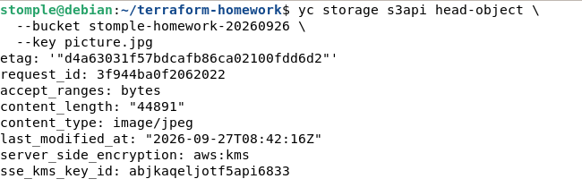
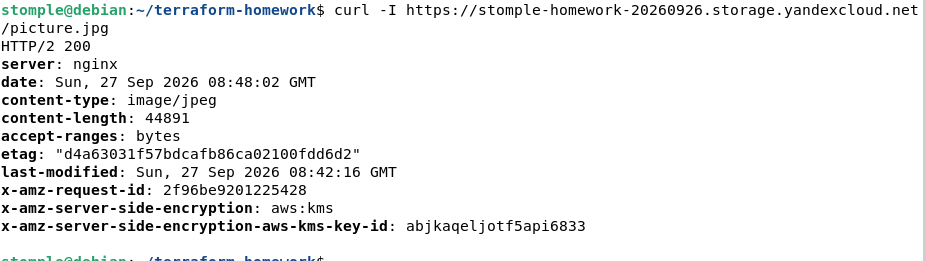

2. Создать статический сайт в Object Storage c собственным публичным адресом и сделать доступным по HTTPS:

 - создать сертификат;

Собственный сертификат в Certificate Manager не создавался. Для раздачи статического сайта из Object Storage по HTTPS используется встроенный wildcard-сертификат Yandex Cloud `*.website.yandexcloud.net`. Для бакетов без точек в имени Object Storage автоматически раздаёт статический сайт по HTTPS с этим сертификатом, без необходимости загружать собственный сертификат безопасности.

 - создать статическую страницу в Object Storage и применить сертификат HTTPS;

Бакет `stomple-site-20260926` создан через Terraform с блоком `website`:

```hcl
resource "yandex_storage_bucket" "site_bucket" {
  bucket     = "stomple-site-20260926"
  access_key = var.access_key
  secret_key = var.secret_key

  anonymous_access_flags {
    read = true
    list = false
  }

  website {
    index_document = "index.html"
  }
}
```

Статическая страница `index.html` загружена в бакет через ресурс `yandex_storage_object.index`:

```hcl
resource "yandex_storage_object" "index" {
  bucket       = yandex_storage_bucket.site_bucket.id
  key          = "index.html"
  source       = "index.html"
  content_type = "text/html"
  access_key   = var.access_key
  secret_key   = var.secret_key

  depends_on = [yandex_storage_bucket.site_bucket]
}
```

Бакет автоматически получает HTTPS-эндпоинт `stomple-site-20260926.website.yandexcloud.net`, к которому привязан wildcard-сертификат Yandex Cloud. Дополнительных действий по применению сертификата не требуется — HTTPS работает сразу после включения настройки `website`.

 - в качестве результата предоставить скриншот на страницу с сертификатом в заголовке (замочек).
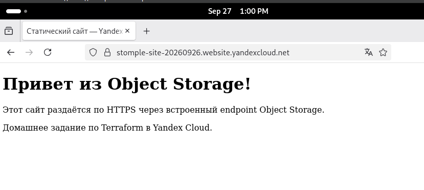

### Правила приёма работы

Домашняя работа оформляется в своём Git репозитории в файле README.md. Выполненное домашнее задание пришлите ссылкой на .md-файл в вашем репозитории.
Файл README.md должен содержать скриншоты вывода необходимых команд, а также скриншоты результатов.
Репозиторий должен содержать тексты манифестов или ссылки на них в файле README.md.
